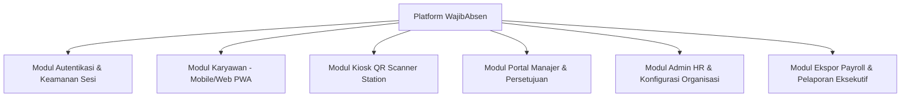
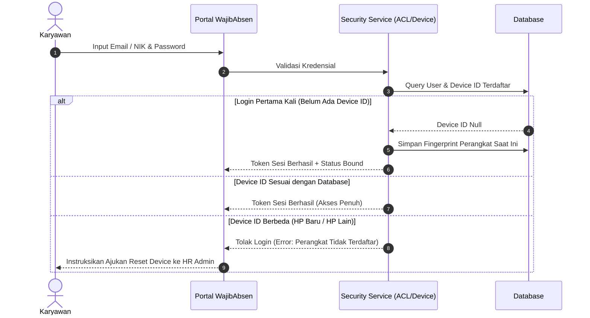
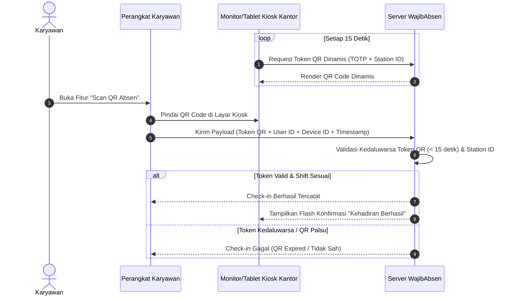
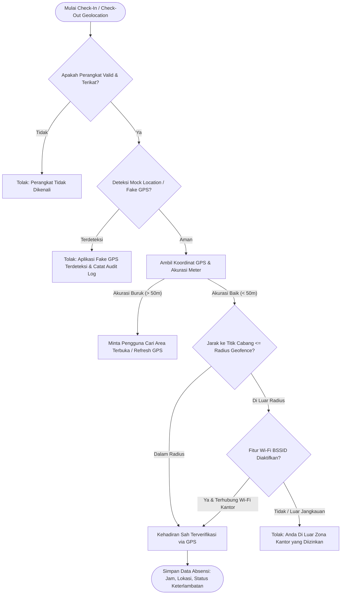
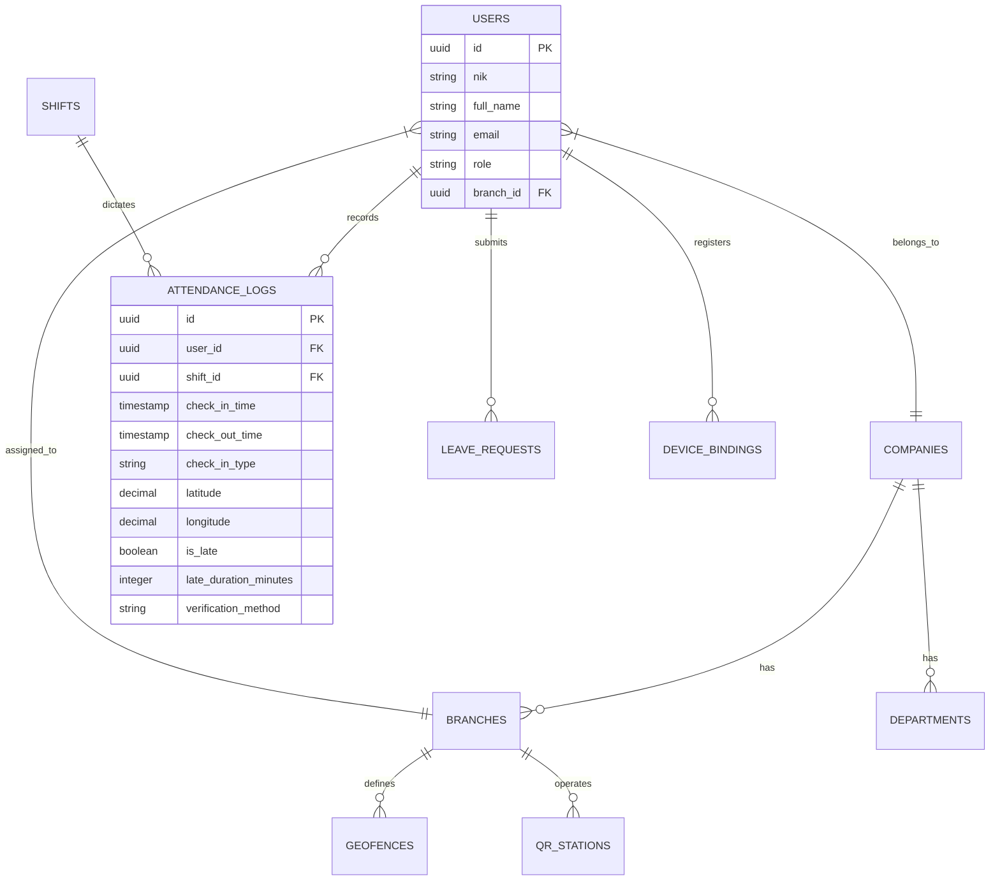
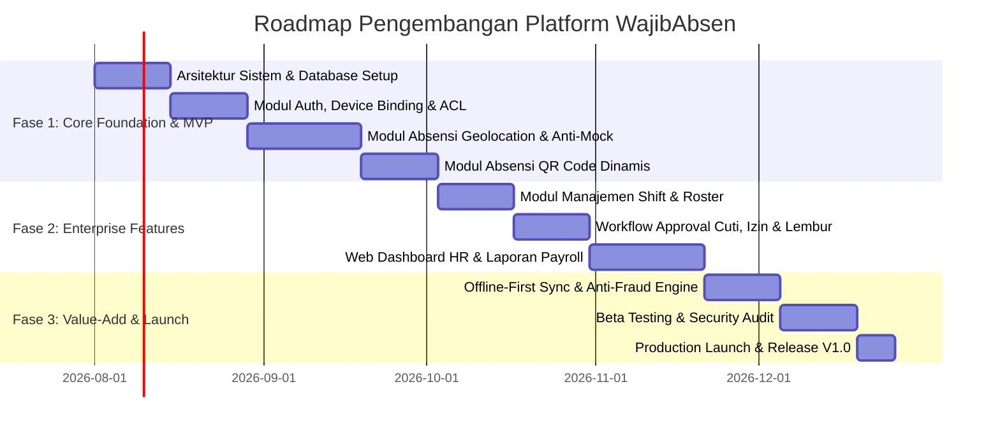

# DOKUMEN PERSYARATAN BISNIS (BUSINESS REQUIREMENTS DOCUMENT - BRD)
## PLATFORM ABSENSI DIGITAL ENTERPRISE: WAJIBABSEN

---

## 1. KONTROL DOKUMEN & INFORMASI PROYEK

| Parameter | Keterangan |
| :--- | :--- |
| **Nama Produk** | **WajibAbsen** – Platform Absensi Digital & Manajemen Kehadiran Enterprise |
| **Dokumen ID** | `BRD-WA-2026-V1.0` |
| **Versi Dokumen** | Versi 1.0 (Comprehensive Release) |
| **Tanggal Pembuatan** | Juli 2026 |
| **Penyusun** | Tim Product Management & Arsitektur Sistem WajibAbsen |
| **Target Pengguna Dokumen** | Stakeholder Bisnis, Product Owner, System Architect, UI/UX Designer, Software Engineer, Quality Assurance |
| **Klasifikasi Dokumen** | Internal & Dokumen Pengembangan Resmi |

---

## 2. RINGKASAN EKSEKUTIF & VISI PRODUK

### 2.1 Latar Belakang
Manajemen kehadiran karyawan di perusahaan berskala menengah hingga besar (perkantoran, pabrik, retail, F&B, lapangan, konstruksi) menghadapi tantangan serius terkait akurasi pencatatan, penipuan kehadiran (*titip absen*, *fake GPS*), fleksibilitas penempatan kerja (WFO/WFH/Remote), serta tingginya beban administrasi rekapitulasi data untuk penggajian (*payroll*). Mesin sidik jari konvensional seringkali tidak efisien untuk tim dengan mobilitas tinggi dan memiliki keterbatasan integrasi real-time.

### 2.2 Visi Platform WajibAbsen
**WajibAbsen** dirancang sebagai platform absensi digital terintegrasi berbasis Web & Progressive Web App (PWA)/Mobile yang mengutamakan **keamanan anti-kecurangan (Zero-Fraud Attendance)**, **kemudahan penggunaan (High Usability)**, dan **fleksibilitas konfigurasi multi-lokasi & multi-shift**. Platform ini menggabungkan teknologi pemindai kode berbarcode dinamis (*Dynamic Rotating QR Code*), verifikasi geolokasi berakurasi tinggi (*High-Accuracy Geofencing*), pemantauan jaringan lokal (*Wi-Fi BSSID Whitelist*), serta kontrol hak akses berjenjang (*Access Control List - ACL*) yang ketat.

### 2.3 Tujuan Utama Bisnis & Target Kinerja (KPI)
1. **Mengeliminasi Praktik Titip Absen & Manipulasi Waktu hingga 99.8%**: Melalui validasi kombinasi *Device Fingerprinting*, *Dynamic QR (TOTP)*, dan deteksi *Mock Location*.
2. **Efisiensi Rekapitulasi Kehadiran & Payroll hingga 85%**: Proses kalkulasi otomatis untuk jam kerja, keterlambatan, pulang cepat, lembur, dan potongan absen.
3. **Ketersediaan Layanan (High Availability & Resilience)**: Memastikan proses absensi tetap berjalan tanpa hambatan baik dalam kondisi online maupun saat gangguan jaringan (*Offline-First Queue*).

---

## 3. DAFTAR ISTILAH & DEFINISI TEKNIS

| Istilah | Definisi |
| :--- | :--- |
| **ACL / RBAC** | *Access Control List / Role-Based Access Control*: Struktur pengaturan izin akses fitur dan data berdasarkan peran pengguna. |
| **Geofencing** | Pembuatan batas keliling virtual berdasarkan koordinat GPS (Latitude/Longitude) dan radius (meter) untuk memvalidasi lokasi karyawan saat melakukan absensi. |
| **Dynamic Rotating QR** | Kode QR berbarcode yang diperbarui setiap 10–15 detik berbasis *Time-based One-Time Password* (TOTP) sehingga tidak dapat difoto/disebarkan melalui pesan singkat. |
| **Mock Location / Fake GPS** | Aplikasi pihak ketiga di perangkat seluler yang memanipulasi titik koordinat GPS palsu. |
| **BSSID Whitelist** | *Basic Service Set Identifier*: Validasi alamat MAC dari Access Point Wi-Fi kantor agar karyawan wajib terhubung ke jaringan fisik kantor saat absensi. |
| **Device Binding** | Pengikatan pengenal unik perangkat (*Device ID / Hardware Fingerprint*) dengan akun karyawan sehingga 1 perangkat hanya dapat digunakan oleh 1 akun. |
| **Offline Queue** | Penyimpanan lokal antrean data absensi terenkripsi saat perangkat tidak terhubung ke internet, dan otomatis diunggah ke server saat koneksi kembali normal. |

---

## 4. RUANG LINGKUP PRODUK (SCOPE OF WORK)



### 4.1 In-Scope (Fitur Utama dalam Pengembangan)
1. Manajemen Master Data Perusahaan, Cabang/Lokasi Kerja, Divisi, Jabatan, dan Karyawan.
2. Pengaturan Shift Kerja (Regular, Shift Bergilir/Roster, Jam Kerja Fleksibel, dan Shift Malam Lintas Hari).
3. Absensi Berbasis Geolocation (GPS Radius + Deteksi Anti-Mock Location + Wi-Fi BSSID).
4. Absensi Berbasis Barcode / QR Code (Mode Kiosk Kantor dengan QR Dinamis & Scanner Perangkat).
5. Alur Pengajuan & Persetujuan (Koreksi Absensi, Cuti, Izin, Sakit, dan Lembur).
6. Rekapitulasi Kehadiran Real-Time & Ekspor Data Siap Payroll (Excel, CSV, PDF, dan API).
7. Pengaturan Hak Akses Berjenjang (ACL) granular per peran dan per cabang.

### 4.2 Out-of-Scope (Batas Lingkup Fase Saat Ini)
1. Perhitungan Pajak PPh 21 dan BPJS secara langsung (disiapkan dalam bentuk ekspor data/API ke sistem Payroll/HRIS eksternal).
2. Perangkat keras IoT khusus selain tablet/smartphone Android/iOS standar untuk Kiosk QR.

---

## 5. STRUKTUR HAK AKSES & PERAN PENGGUNA (ACL / RBAC MATRIX)

Platform **WajibAbsen** menerapkan struktur hirarki peran yang jelas guna menjamin kerahasiaan data dan kepatuhan audit.

### 5.1 Definisi 5 Peran Utama (User Roles)

1. **Super Admin (Platform Owner / System Administrator)**
   - Memiliki kontrol penuh atas infrastruktur aplikasi, manajemen penyewa (*Multi-Tenant* jika SaaS), lisensi, log sistem tingkat dasar, dan pengaturan global keamanan.
2. **HR / Perusahaan Admin (Tenant Admin)**
   - Bertanggung jawab penuh atas operasional kebijakan SDM perusahaan. Memiliki hak penuh untuk mengelola data karyawan, konfigurasi cabang, batas geofence, stasiun QR, aturan jam kerja, shift, serta menyetujui atau menolak seluruh transaksi pengajuan di bawah perusahaannya.
3. **Manajer / Supervisor (Atasan Langsung)**
   - Memiliki akses terbatas hanya kepada tim/sub-divisi di bawah kepemimpinannya. Bertugas memantau kehadiran harian tim, menerima notifikasi keterlambatan, serta melakukan persetujuan tingkat pertama (*First-Level Approval*) atas izin, cuti, lembur, atau koreksi absen bawahan.
4. **Karyawan (Staff / Employee)**
   - Pengguna akhir yang melakukan absensi masuk/pulang, melihat riwayat kehadiran pribadi, melihat sisa kuota cuti, dan mengajukan permintaan cuti/izin/lembur/koreksi absen melalui antarmuka web/mobile.
5. **Auditor / Keuangan / Payroll Specialist**
   - Akses baca (*Read-Only*) untuk laporan kehadiran, rekapitulasi keterlambatan, potongan jam kerja, dan ekspor data penggajian tanpa dapat mengubah konfigurasi master data.

### 5.2 Matriks Hak Akses Granular (ACL CRUD Matrix)

| Modul & Fitur | Super Admin | HR Admin | Manajer / Supervisor | Karyawan | Payroll / Auditor |
| :--- | :---: | :---: | :---: | :---: | :---: |
| **Konfigurasi Platform & Lisensi** | Full Control | No Access | No Access | No Access | No Access |
| **Manajemen Cabang & Geofence** | Full Control | Full Control | View Only | No Access | View Only |
| **Manajemen QR Kiosk Station** | Full Control | Full Control | View Only | No Access | No Access |
| **Master Data Karyawan & Akun** | Full Control | Full Control | View Only (Tim Sendiri) | View Profile Sendiri | View Only |
| **Reset Device ID / Binding HP** | Full Control | Full Control | Request Only | Request Only | No Access |
| **Aturan Shift & Roster Kerja** | Full Control | Full Control | Assign Shift (Tim Sendiri) | View Jadwal Sendiri | View Only |
| **Check-in / Check-out Absensi** | No Access | Yes (Kondisi Khusus) | Yes | Yes | No Access |
| **Approval Cuti / Izin / Lembur** | Full Control | Final / Override Approve | 1st Level Approve | Submit Only | View Only |
| **Approval Koreksi Kehadiran** | Full Control | Final / Override Approve | 1st Level Approve | Submit Only | View Only |
| **Laporan & Rekapitulasi Absensi** | Full Control | Full Control | View (Tim Sendiri) | View (Pribadi) | Full Control |
| **Ekspor Laporan & Format Payroll** | Full Control | Full Control | No Access | No Access | Full Control |
| **Audit Trail & Aktivitas Sistem** | Full Control | View (Tenant Only) | No Access | No Access | View Only |

---

## 6. ARSITEKTUR ALUR KERJA UTAMA (BUSINESS & USER FLOWS)

### 6.1 Alur Autentikasi & Keamanan Pengikatan Perangkat (Device Binding)



### 6.2 Alur Absensi Kode QR Dinamis (Dynamic Rotating Barcode/QR)



### 6.3 Alur Absensi Geolocation + Validasi Anti-Mock GPS



---

## 7. SPESIFIKASI KEBUTUHAN FUNGSIONAL TERPERINCI

### MOD-01: Autentikasi & Keamanan Sesi
* **REQ-AUTH-01 (Single Device Binding)**: Sistem wajib mengikat identitas perangkat (*Hardware Fingerprint / Browser Fingerprint*) pengguna pada login pertama. Login pada perangkat kedua wajib ditolak kecuali HR Admin menyetujui permintaan reset perangkat.
* **REQ-AUTH-02 (Keamanan Sesi & Token JWT)**: Sesi pengguna menggunakan JWT dengan masa kedaluwarsa akses (*Access Token*: 8 jam, *Refresh Token*: 7 hari dengan rotasi otomatis).
* **REQ-AUTH-03 (Manajemen Reset Device ID)**: Karyawan dapat mengajukan permintaan "Ganti Perangkat" melalui formulir mandiri dengan melampirkan alasan (misal: ponsel hilang/rusak). HR Admin menerima notifikasi dan dapat menyetujui dengan satu klik.

### MOD-02: Portal & Dashboard Karyawan (Web Responsive / PWA)
* **REQ-EMP-01 (Ringkasan Hari Ini)**: Menampilkan jadwal shift hari ini, jam masuk kerja, batas waktu keterlambatan, jam pulang, dan tombol aksi cepat (*Check-In / Check-Out*).
* **REQ-EMP-02 (Riwayat Kehadiran Pribadi)**: Karyawan dapat melihat kalender kehadiran bulanan lengkap dengan status warna: Hadir Tepat Waktu (Hijau), Terlambat (Kuning), Pulang Cepat (Jingga), Mangkir/Alpha (Merah), Cuti/Izin (Biru).
* **REQ-EMP-03 (Pengajuan Mandiri / Self-Service)**: Formulir terpadu untuk pengajuan Izin, Cuti, Sakit (unggah lampiran surat dokter), Lembur, serta Koreksi Absen apabila lupa *check-in/check-out*.

### MOD-03: Mesin Absensi Barcode / QR Code (Dynamic Rotating QR)
* **REQ-QR-01 (Kiosk Display Station)**: Tersedia mode layar khusus (*Kiosk Mode*) untuk dipasang di tablet/monitor lobi kantor. Kiosk menampilkan jam server real-time dan Kode QR dinamis yang berputar setiap 15 detik.
* **REQ-QR-02 (Anti-Screenshot Protection)**: Kode QR mengandung *HMAC-SHA256 timestamp signature*. Jika karyawan memindai tangkapan layar kode QR yang berumur lebih dari jangka waktu kedaluwarsa, sistem otomatis menolak dan mencatat insiden percobaan manipulasi.
* **REQ-QR-03 (Multi-Station Support)**: Perusahaan dapat mendaftarkan banyak stasiun QR (misal: *Lantai 1 Pintu Utama*, *Gudang Produksi*, *Pintu Belakang*) untuk pelacakan alur masuk yang lebih spesifik.

### MOD-04: Mesin Absensi Geolocation & Geofencing
* **REQ-GEO-01 (Multi-Geofencing Radius)**: Setiap karyawan dapat ditugaskan ke satu atau beberapa lokasi kerja yang diizinkan (misal: Kantor Pusat + Cabang Jakarta Selatan). Radius dapat dikonfigurasi per lokasi (misal: 30 meter hingga 100 meter).
* **REQ-GEO-02 (Anti-Mock GPS / Fake GPS Verification)**: Pada aplikasi PWA/Mobile, modul pemindai harus memeriksa *provider status* dan metadata geolokasi. Jika terdeteksi atribut koordinat tiruan dari aplikasi pihak ketiga, sistem menolak absensi dan memberi peringatan.
* **REQ-GEO-03 (Secondary Wi-Fi BSSID Verification)**: Untuk gedung bertingkat dengan sinyal GPS lemah/melompat, sistem mendukung verifikasi berdasarkan alamat MAC Wi-Fi kantor (*BSSID Whitelist*) sebagai alternatif validasi sah.

### MOD-05: Manajemen Shift, Jadwal & Roster Kerja
* **REQ-SHF-01 (Konfigurasi Aturan Jam Kerja)**: Mendukung pembuatan shift reguler (misal: 08:00 – 17:00), toleransi keterlambatan (*Grace Period*, misal: 15 menit), perhitungan setengah hari, dan shift malam lintas hari (*Overnight Shift*, misal: 22:00 – 06:00).
* **REQ-SHF-02 (Flexible Working Hours)**: Mendukung skema jam kerja fleksibel (misal: wajib memenuhi 8 jam kerja per hari dengan jam kedatangan antara 07:00 hingga 10:00).
* **REQ-SHF-03 (Roster / Assignment Shift Massal)**: HR Admin atau Manajer dapat mengunggah atau mengatur jadwal shift bulanan tim secara visual atau impor melalui template Excel.

### MOD-06: Alur Persetujuan (Approval Workflow)
* **REQ-APP-01 (Multi-Level Approval Matrix)**: Alur persetujuan dapat dikonfigurasi 1 tingkat (langsung HR) atau 2 tingkat (Manajer Langsung $\rightarrow$ HR Admin).
* **REQ-APP-02 (Notifikasi Real-Time)**: Setiap pengajuan dari karyawan memicu notifikasi kepada pihak penyetuju, serta notifikasi balasan saat status pengajuan disetujui atau ditolak.

### MOD-07: Pelaporan, Analitik & Ekspor Payroll
* **REQ-REP-01 (Laporan Rekapitulasi Kehadiran)**: Menyajikan tabel ringkasan harian dan bulanan per divisi/cabang berisi total hadir, terlambat (dalam menit), pulang cepat, lembur, cuti, dan tanpa keterangan.
* **REQ-REP-02 (Ekspor Siap Payroll)**: Menyediakan format ekspor CSV/XLSX yang dapat langsung disesuaikan dengan skema sistem penggajian (*Payroll Ready Format*), memisahkan komponen jam normal, jam lembur, dan potongan denda keterlambatan.

---

## 8. PERSYARATAN NON-FUNGSIONAL (NON-FUNCTIONAL REQUIREMENTS - NFR)

| Kategori | Parameter Kinerja / Persyaratan Standar |
| :--- | :--- |
| **Kinerja & Kecepatan (Performance)** | Waktu respons pemrosesan absensi (*Check-In/Check-Out API*) maksimal **< 400 milidetik** di bawah beban puncak pagi hari. |
| **Konkurensi (Concurrency)** | Sistem harus mampu menangani minimal **500 - 10,000 permintaan absensi serentak per menit** tanpa kegagalan transaksi (*Deadlock Free*). |
| **Keandalan (Reliability & SLA)** | Target ketersediaan layanan (*Uptime SLA*) minimal **99.9%** per bulan. |
| **Keamanan Data (Data Security)** | Seluruh komunikasi jaringan wajib dienkripsi menggunakan **TLS 1.3**. Kata sandi pengguna disimpan menggunakan algoritma **bcrypt / Argon2**. |
| **Kepatuhan Privasi (Compliance)** | Mematuhi **Undang-Undang Perlindungan Data Pribadi (UU PDP Indonesia No. 27/2022)** dengan kebijakan penyimpanan data riwayat kehadiran yang jelas dan hak penghapusan data. |
| **Responsivitas UI (Usability)** | Antarmuka menyesuaikan dengan sempurna pada layar ponsel cerdas (360px width), tablet kiosk, dan monitor desktop tanpa patah atau pergeseran tata letak. |

---

## 9. REKOMENDASI ARSITEKTUR TEKNIS & STRUKTUR DATA

### 9.1 Diagram Arsitektur Tingkat Tinggi (High-Level Architecture)

```mermaid
graph LR
    subgraph Client Layer
        M[Mobile / PWA Client]
        K[Kiosk QR Station]
        W[Web Dashboard Admin/Manager]
    end

    subgraph Edge / Security Layer
        CDN[Cloudflare CDN & WAF]
        LB[Load Balancer / Reverse Proxy]
    end

    subgraph Application & Service Layer
        API[Core WajibAbsen API Engine]
        GEO[Geolocation & Geofencing Service]
        QR[Dynamic TOTP QR Service]
        NOTIF[Email & Webhook Service]
    end

    subgraph Data & Cache Layer
        REDIS[(Redis Cache - Token & Geo-Index)]
        DB[(Primary Database - PostgreSQL)]
    </subgraph>

    M --> CDN --> LB --> API
    K --> CDN --> LB --> API
    W --> CDN --> LB --> API
    API <--> REDIS
    API <--> GEO
    API <--> QR
    API <--> DB
```

### 9.2 Skema Entitas Relasional Utama (Conceptual ERD)



---

## 10. PENINGKATAN STRATEGIS UNTUK MENINGKATKAN NILAI JUAL PRODUK (COMMERCIAL VALUE-ADD IMPROVEMENTS)

Agar platform **WajibAbsen** memiliki daya saing tinggi dan nilai jual komersial yang superior dibanding pesaing absensi di pasaran, berikut adalah **7 Fitur Unggulan & Strategi Peningkatan Nilai Jual (Product USP & Enhancements)** yang disarankan untuk diimplementasikan:

### 1. Offline-First Attendance Queue dengan Background Sync
* **Masalah Pasar**: Banyak perusahaan dengan proyek konstruksi, pertambangan, perkebunan, atau area basement kantor mengalami kendala sinyal internet, menyebabkan gagal check-in dan keluhan karyawan.
* **Solusi WajibAbsen**: Implementasikan arsitektur *Offline-First*. Saat ponsel tidak memiliki sinyal internet, data absensi (koordinat GPS terakhir + timestamp enkripsi + tanda tangan lokal) disimpan dalam *Secure Local Storage/IndexedDB*. Begitu perangkat terhubung kembali ke internet, sistem melakukan sinkronisasi otomatis (*Silent Background Sync*) tanpa manipulasi waktu server.
* **Dampak Nilai Jual**: Menjadikan produk layak jual ke sektor industri berat dan lapangan, bukan hanya perkantoran kota.

### 2. Multi-Layer Anti-Fraud Engine (Skor Kepercayaan Absensi / Trust Score)
* **Masalah Pasar**: Karyawan semakin canggih menggunakan aplikasi *Mock Location*, VPN, atau satu ponsel dipakai bergantian untuk beberapa akun.
* **Solusi WajibAbsen**: Setiap log absensi menghasilkan **Attendance Trust Score (0 - 100%)**. Sistem menganalisis kombinasi:
  - Apakah kecepatan perpindahan lokasi masuk akal (*Impossible Travel Velocity check*).
  - Apakah terdeteksi tanda-tanda injeksi koordinat GPS palsu.
  - Apakah alamat IP/BSSID konsisten dengan lokasi fisik.
  Jika *Trust Score* di bawah 70%, absensi tetap tercatat namun ditandai bendera peringatan (**Flagged for Audit**) bagi manajer/HR.
* **Dampak Nilai Jual**: Menjadi poin jualan utama bagi direksi dan manajemen SDM yang mengutamakan kedisiplinan dan keaslian data.

### 3. Smart Payroll & HRIS Universal Connector (Plug-and-Play Integration)
* **Masalah Pasar**: HRD enggan mengganti sistem absensi baru jika proses pemindahan data ke software penggajian existing mereka rumit.
* **Solusi WajibAbsen**: Sediakan fitur **Universal Payroll Exporter & Webhook**. Pengguna dapat memilih template ekspor siap pakai untuk software populer di Indonesia (misal: format impor CSV standar Talenta/Mekari, Accurate, SAP, Odoo) atau mengaktifkan REST Webhook agar data kehadiran langsung mengalir ke sistem internal mereka secara otomatis.
* **Dampak Nilai Jual**: Menurunkan hambatan migrasi calon pelanggan B2B secara drastis.

### 4. Ekosistem Shift Dinamis & Auto-Shift Detection (Smart Shift)
* **Masalah Pasar**: Untuk outlet ritel/F&B dengan jadwal kerja yang berganti mendadak atau karyawan yang sering bertukar shift, admin HR kelelahan mengubah jadwal secara manual di aplikasi.
* **Solusi WajibAbsen**: Fitur **Smart Auto-Shift Detection**. Ketika karyawan melakukan absen masuk, sistem secara pintar mencocokkan waktu kedatangan dengan profil shift yang paling mendekati (misal: membedakan otomatis antara *Shift Pagi 07:00* dengan *Shift Siang 13:00*) tanpa perlu konfigurasi manual setiap hari oleh Admin.
* **Dampak Nilai Jual**: Efisiensi operasional sangat tinggi untuk bisnis ritel, rumah sakit, dan F&B.

### 5. Dasbor Analitik Eksekutif & Peringatan Dini (Early Warning System)
* **Masalah Pasar**: Laporan absensi biasa hanya berupa tabel data historis yang mati, tidak memberikan wawasan aksi kepada pimpinan.
* **Solusi WajibAbsen**: Dasbor eksekutif dengan insight proaktif:
  - *Tren Tingkat Keterlambatan Per Divisi*.
  - *Peringatan Dini Lembur Berlebih (Overtime Burnout & Cost Alert)*.
  - *Peringatan Ketidakhadiran Tanpa Keterangan Berturut-turut*.
* **Dampak Nilai Jual**: Mengubah aplikasi absensi dari sekadar "alat catat jam" menjadi "pusat intelijen kepatuhan SDM".

### 6. Gamifikasi Kedisiplinan & Punctuality Leaderboard
* **Masalah Pasar**: Absensi sering dianggap sebagai elemen kontrol yang menegangkan bagi karyawan.
* **Solusi WajibAbsen**: Sediakan modul opsional **Punctuality Badge & Leaderboard**. Karyawan yang konsisten hadir tepat waktu mendapatkan *Lencana Kedisiplinan Bulanan* atau skor positif yang dapat diunduh atau dinilai oleh HR untuk penghargaan (*Employee of the Month*).
* **Dampak Nilai Jual**: Meningkatkan keterlibatan karyawan (*Employee Engagement*) dan budaya positif perusahaan.

### 7. Mode Kiosk Multi-Fungsi dengan Face & QR Hybrid Validation
* **Masalah Pasar**: Di pabrik atau area di mana karyawan tidak diizinkan membawa ponsel ke lantai produksi, absensi melalui HP pribadi tidak dimungkinkan.
* **Solusi WajibAbsen**: Mode **Station Kiosk Terpadu** pada tablet yang dapat memindai QR Code dari kartu identitas karyawan sekaligus mencocokkan konfirmasi swafoto cepat dalam waktu kurang dari 2 detik.
* **Dampak Nilai Jual**: Memperluas segmen pasar hingga industri manufaktur, pergudangan, dan pabrik padat karya.

---

## 11. ROADMAP & RENCANA IMPLEMENTASI PENGEMBANGAN



---
*End of Business Requirements Document – WajibAbsen Platform V1.0*
